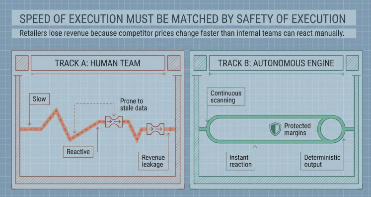

# Autonomous Competitor Intelligence & Dynamic Pricing Engine

Production-ready Project A submission: FastAPI, LangGraph, Gemini, Jina Reader, Supabase pgvector, and a polished multi-page SaaS operator dashboard.

## Hosted Application

- Frontend: https://autonomous-competitor-intelligence.vercel.app/
- Backend API docs: https://autonomous-competitor-intelligence.onrender.com/docs
- Backend health: https://autonomous-competitor-intelligence.onrender.com/api/v1/health

## System Mind Map

The project also includes a NotebookLM-generated mind map for a quick reviewer overview of the workflow, architecture, agent pipeline, and deployment surface.



## Product Workflow

1. Create or manage tracked products with SKU, brand, category, cost, current price, target margin, and lifecycle status.
2. Create competitors and attach competitor product URL targets to tracked products.
3. Run a scan from a saved target or one-off URL.
4. LangGraph executes named agents: Ingestion, Classifier, Analyst, Decision Maker, Webhook.
5. Supabase pgvector verifies semantic product match.
6. The pricing engine recommends a 5% undercut while enriching the decision with confidence, trend, volatility, stock, and margin reasoning.
7. If autopilot is enabled, the storefront webhook receives the update.

## Architecture

- Frontend: Next.js App Router, TypeScript, Tailwind CSS, Lucide Icons, Recharts, Framer Motion.
- Backend: Python 3.11, FastAPI, Uvicorn, strict Pydantic v2 schemas.
- Agent orchestration: LangGraph named-agent pipeline.
- Database: Supabase PostgreSQL with pgvector.
- Scraping and AI: Jina Reader for Markdown extraction, Gemini for structured parsing and embeddings.
- Deployment: Render backend, Vercel frontend.

## Supabase Schema

Run `database/schema.sql` in Supabase SQL Editor. It creates:

- `tracked_products`
- `competitor_products`
- `competitors`
- `competitor_targets`
- `agent_runs`
- `agent_run_events`
- `pricing_history`
- `pricing_alerts`
- `match_products(sample_embedding, similarity_threshold)`

Backend writes require `SUPABASE_SERVICE_ROLE_KEY` or a Supabase server secret. Publishable keys are not enough for production writes.

Seed reviewer-ready example data after running the schema:

```powershell
cd backend
..\.venv\Scripts\python.exe scripts\seed_supabase.py
```

The seed script creates:

- 3 tracked products with SKU, brand, category, target margin, and descriptions
- 2 competitors
- 3 competitor URL targets
- 3 competitor observations with embeddings for `match_products`
- 6 pricing history checkpoints for the chart

Example scan payloads are also stored in `backend/scripts/sample_scan_payloads.json`.

## Environment

Backend `backend/.env`:

```env
GEMINI_API_KEY=
GEMINI_MODEL=gemini-2.5-flash
GEMINI_EMBEDDING_MODEL=gemini-embedding-001
EMBEDDING_DIMENSIONS=1536
SUPABASE_URL=https://your-project.supabase.co
SUPABASE_SERVICE_ROLE_KEY=sb_secret_or_service_role_key
STOREFRONT_WEBHOOK_URL=https://your-backend.onrender.com/api/v1/mock-storefront-webhook
ENABLE_DEMO_FALLBACKS=false
```

Frontend `frontend/.env.local`:

```env
NEXT_PUBLIC_API_BASE_URL=https://autonomous-competitor-intelligence.onrender.com/api/v1
```

## Local Setup

```powershell
python -m venv .venv
.\.venv\Scripts\python.exe -m pip install -r backend\requirements.txt
cd backend
..\.venv\Scripts\uvicorn.exe main:app --reload --host 127.0.0.1 --port 8000
```

```powershell
cd frontend
npm install
npm run dev
```

Open `http://127.0.0.1:3000`.

## Verification

```powershell
.\.venv\Scripts\python.exe -m compileall backend
cd frontend
npm run typecheck
npm run lint
npm run build
```

Smoke endpoints:

- `GET /api/v1/health`
- `GET /api/v1/dashboard`
- `GET /api/v1/alerts`
- `GET /api/v1/competitors`
- `POST /api/v1/competitors`
- `PATCH /api/v1/products/{product_id}`
- `DELETE /api/v1/products/{product_id}`
- `GET /api/v1/competitor-targets`
- `GET /api/v1/scans`
- `GET /api/v1/analytics/summary`
- `GET /api/v1/analytics/pricing-trends`
- `GET /api/v1/analytics/scan-volume`
- `POST /api/v1/scan`

Example scan request:

```json
{
  "product_id": "6468b79d-7a35-4d95-aec9-749ab4071239",
  "competitor_name": "MarketWatch Reference",
  "competitor_url": "https://fakestoreapi.com/products/1"
}
```

## Assignment Alignment

- Supabase: spec tables, pgvector index, compatibility views, persistent alerts, target URLs, and scan-run history.
- LangGraph: named agents for ingestion, classification, vector analysis, decisioning, and webhook dispatch.
- FastAPI: REST endpoints for dashboard state, settings, scans, alerts, products, targets, logs, and mock storefront webhook.
- Dashboard: premium multi-page SaaS command center with sidebar navigation, KPI cards, products, competitors, scans, alerts, readiness, autopilot controls, catalog intelligence, and pricing trajectories.
- Pricing intelligence: deterministic 5% undercut and margin-floor guardrails enriched with confidence, spec score, trend, volatility, stock signal, and structured reasoning.
- Deployment: Docker-ready backend and Vercel-ready frontend with env-only secrets.

## Five-Minute Loom Script

1. Open the Vercel dashboard and show the Command Center.
2. Open the Products page and explain tracked product cost/current price.
3. Open Competitors and add or select a competitor URL target.
4. Run a scan and walk through the agent execution timeline.
5. Show semantic match confidence, price-to-spec ratio, margin floor, and pricing recommendation.
6. Show Alerts and Scan History as persistent operational evidence.
7. Open the Render `/docs` page and point to the FastAPI endpoints.

## Deployment Checklist

- Rotate any keys that were pasted into local files or chat.
- Confirm `.env` and `.env.local` are ignored.
- Run `database/schema.sql` in Supabase.
- Set backend env vars in Render.
- Set Vercel `NEXT_PUBLIC_API_BASE_URL` to the Render API URL plus `/api/v1`.
- Smoke test frontend, backend health, dashboard, alerts, targets, scans, and Swagger docs.
